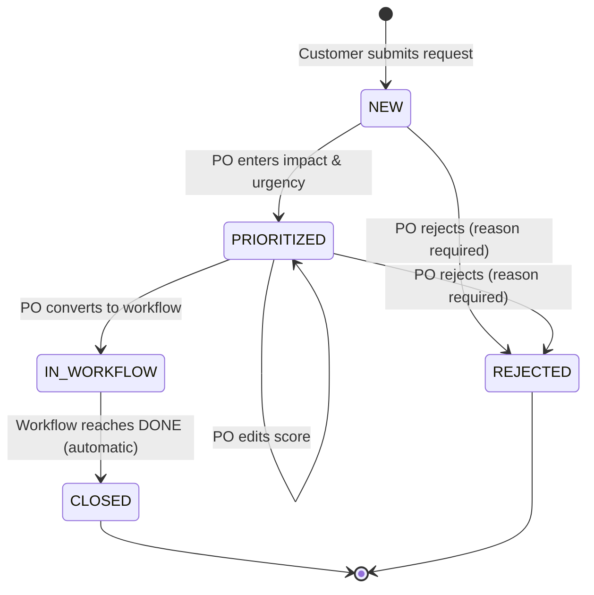
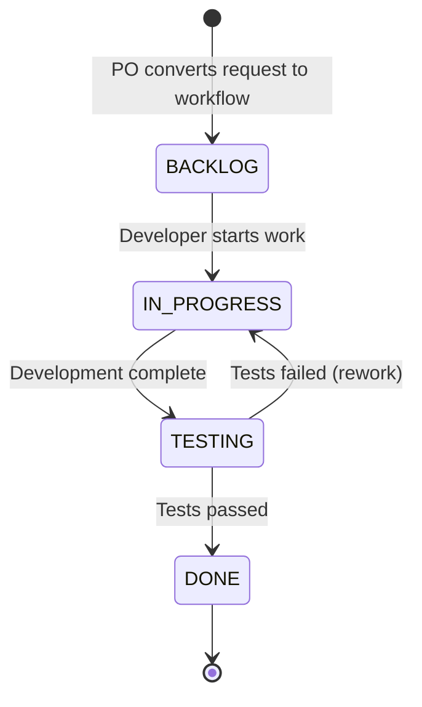
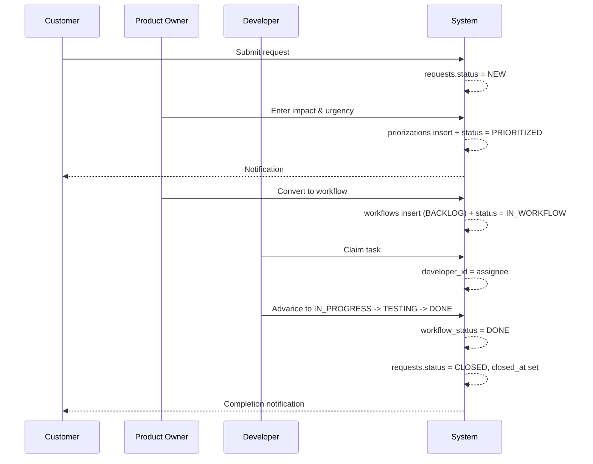

# State Diagrams and Transition Rules

> Request Management System
> This document models the two state machines in the system, their allowed transitions, and the rules governing them.

---

## 1. Overview

The system contains two independent but linked state machines:

| State Machine | Field | Scope |
|---|---|---|
| **Request lifecycle** | `requests.status` | The business-level journey of a customer request |
| **Workflow lifecycle** | `workflows.workflow_status` | The development-level journey of a task derived from a request |

They are linked at two points:

- When a request is converted to a workflow, `requests.status` becomes `IN_WORKFLOW` and a workflow record is created in `BACKLOG`
- When a workflow reaches `DONE`, the linked request automatically transitions to `CLOSED`

Keeping them separate prevents conflating *what the customer sees* with *what the development team tracks*. A customer does not need to know whether a task is in `TESTING`; they only need to know their request is being worked on.

---

## 2. Request Lifecycle

### 2.1 Diagram



### 2.2 Transition Matrix

| # | From | To | Triggered by | Condition | Side effects |
|---|---|---|---|---|---|
| 1 | — | `NEW` | Customer | Request form submitted | `requests` insert, `created_at` set |
| 2 | `NEW` | `PRIORITIZED` | PO | Impact and urgency entered | `priorizations` insert, `prioritized_by` set, notification to customer |
| 3 | `PRIORITIZED` | `PRIORITIZED` | PO | Score edited (self-transition) | `priorizations` update |
| 4 | `PRIORITIZED` | `IN_WORKFLOW` | PO | "Convert to Workflow" action | `workflows` insert with `BACKLOG`, history entry |
| 5 | `NEW` | `REJECTED` | PO | Rejection with mandatory reason | `rejection_reason` set, notification to customer |
| 6 | `PRIORITIZED` | `REJECTED` | PO | Rejection with mandatory reason | `rejection_reason` set, notification to customer |
| 7 | `IN_WORKFLOW` | `CLOSED` | System (automatic) | Linked workflow reaches `DONE` | `closed_at` set, notification to customer |

### 2.3 Forbidden Transitions

| Attempted transition | Why it is rejected |
|---|---|
| `NEW` → `IN_WORKFLOW` | Prioritization cannot be skipped — a request must be scored before entering development |
| `IN_WORKFLOW` → `REJECTED` | Development has already started; rejecting at this stage would orphan an active workflow |
| `IN_WORKFLOW` → `PRIORITIZED` | Scores cannot be edited once development begins |
| `CLOSED` → any state | Final state |
| `REJECTED` → any state | Final state (dead end) |
| Any transition triggered by Customer or Developer | Only PO (or the system, for #7) may transition request status |

All forbidden transitions raise `InvalidRequestTransitionException`, which the global exception handler maps to HTTP 409 Conflict.

---

## 3. Workflow Lifecycle

### 3.1 Diagram



### 3.2 Transition Matrix

| # | From | To | Triggered by | Condition | Side effects |
|---|---|---|---|---|---|
| 1 | — | `BACKLOG` | PO | Request converted to workflow | `workflows` insert, `developer_id` may be null |
| 2 | `BACKLOG` | `IN_PROGRESS` | Developer | Task is assigned (`developer_id` not null) | History entry |
| 3 | `IN_PROGRESS` | `TESTING` | Developer | Development complete | History entry |
| 4 | `TESTING` | `DONE` | Developer | Tests passed, confirmation dialog accepted | History entry, linked request → `CLOSED`, notification to customer |
| 5 | `TESTING` | `IN_PROGRESS` | Developer | Tests failed, rework needed | History entry, counted in test rework rate metric |

### 3.3 Forbidden Transitions

| Attempted transition | Why it is rejected |
|---|---|
| `BACKLOG` → `TESTING` or `DONE` | Steps cannot be skipped |
| `IN_PROGRESS` → `DONE` | Testing stage cannot be bypassed |
| `BACKLOG` → `IN_PROGRESS` while `developer_id` is null | Work cannot begin without an owner |
| `DONE` → any state | Final state — once a developer marks a task done, it is done |
| Any transition by a developer other than the assignee | Only the assigned developer may advance their own task |

All forbidden transitions raise `InvalidWorkflowTransitionException`, mapped to HTTP 409 Conflict.

---

## 4. Cross-Machine Interaction



**Key point:** the transition from `DONE` to `CLOSED` is automatic and requires no PO approval. When a developer marks a task complete, the request closes in the same transaction.

---

## 5. Implementation Notes

### 5.1 Transition Logic Belongs to the Enum

Transition rules are defined inside the enum itself, not scattered across service classes:

```java
public enum WorkflowStatus {
    BACKLOG, IN_PROGRESS, TESTING, DONE;

    public boolean canTransitionTo(WorkflowStatus target) { ... }
}
```

The service layer only asks the enum whether a transition is legal and raises an exception if it is not. This keeps transition knowledge in one place and prevents the service from accumulating conditional logic.

The same pattern applies to `RequestStatus`.

### 5.2 Atomicity

Every transition that touches more than one table executes within a single transaction. The multi-step transitions are:

| Transition | Must be atomic |
|---|---|
| `NEW` → `PRIORITIZED` | `priorizations` insert + status update + history + notification |
| `PRIORITIZED` → `IN_WORKFLOW` | `workflows` insert + status update + history |
| `TESTING` → `DONE` | workflow status update + request status → `CLOSED` + `closed_at` + history + notification |
| → `REJECTED` | status update + `rejection_reason` + history + notification |

If any step fails, the entire transition rolls back. A partially applied transition (workflow created but request status unchanged) would leave the system inconsistent.

### 5.3 Concurrency

Transitions that could be triggered simultaneously by more than one user use row-level locking (`SELECT ... FOR UPDATE`):

- Two developers claiming the same unassigned task
- A PO assigning a developer while another developer self-assigns
- Two PO sessions converting the same request to a workflow

### 5.4 Irreversible Transitions Require Confirmation

Transitions into a final state cannot be undone, so the UI presents a confirmation dialog before executing them:

- `TESTING` → `DONE` (also closes the request)
- `NEW` / `PRIORITIZED` → `REJECTED`

Reversible transitions (such as `TESTING` → `IN_PROGRESS`) require no confirmation.

### 5.5 Audit Trail

Every transition writes a row to `request_status_history` capturing the old status, new status, the acting user, and the timestamp. This serves two purposes: traceability, and as the data source for the test rework rate metric (`TESTING` → `IN_PROGRESS` transition frequency).

---

## 6. Status Visibility by Role

| Status | Customer sees | PO sees | Developer sees | Admin sees |
|---|---|---|---|---|
| `NEW` | "Your request has been received" | `NEW` | — | `NEW` |
| `PRIORITIZED` | "Your request is under evaluation" | `PRIORITIZED` + score | — | `PRIORITIZED` + score |
| `IN_WORKFLOW` | "Your request is being worked on" | `IN_WORKFLOW` + workflow status | Workflow status + score | Both |
| `CLOSED` | "Your request has been completed" | `CLOSED` | `DONE` | `CLOSED` |
| `REJECTED` | "Your request was not taken forward" + reason | `REJECTED` + reason | — | `REJECTED` + reason |

The customer never sees raw status codes, priority scores, or the internal workflow stage.
